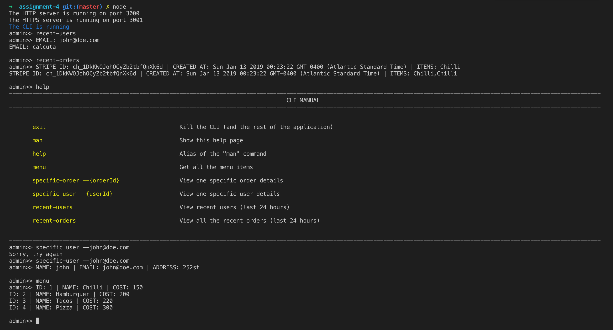
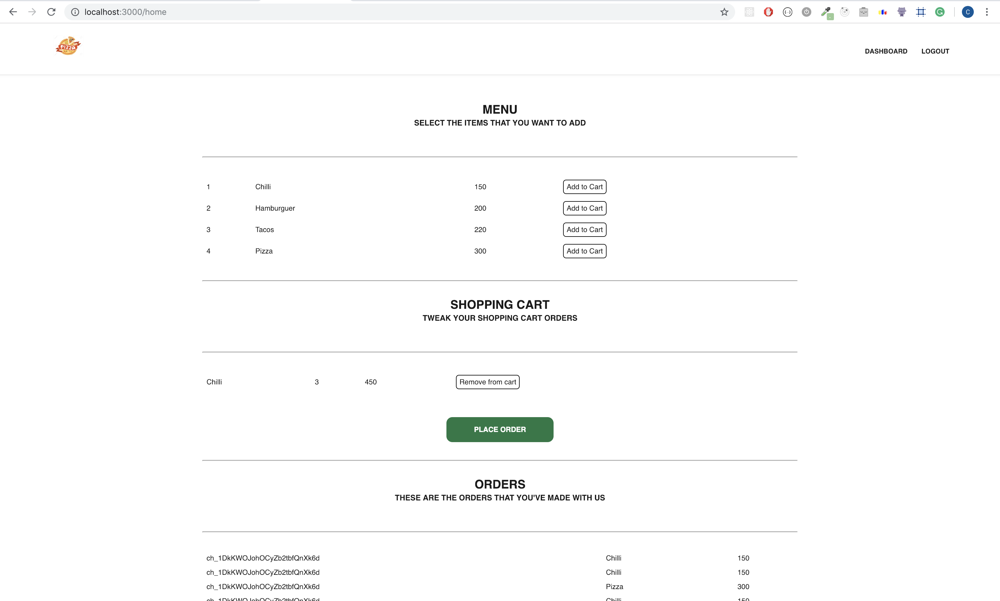

# Pirple Home Assignment #4 - Admin CLI!
This app emulates the pizza API where the user can be managed, they can see the menu, add items to their shopping
cart and then place the order.

Frontend was included in this task. Also an admin CLI.

### Running the server
Type `node .` to run the server. Please configure your Mailgun and Stripe credentials in the config file before using the application.

### Using the CLI
After running the server, a CLI prompt will appear. Run help to see a list of all the available commands.

<div align="center">
  
</div>

## Using the Frontend
Go to localhost:3000 and it will send you (the first time) to the login screen. You can click on signup to create a new account.

When you've logged in you will have access to the Dashboard where you can add items to your cart and place the order when you feel ready. You will be prompted for your Credit Card. After you enter it, you will receive an email from Mailgun and the payment will be processed using Stripe. All your orders are going to be visible in the Dashboard.

<div align="center">
  
</div>

## Using the API
The API responses have the following structure:
```
{
  "statusCode": 200,
  "data": {}
}
```

The following endpoints are available:

### Authentication
```
POST /users/login (parameters: email, password)
POST /users/logout (headers: token)
```

Authenticates the user. The login endpoint returns a token in the data attribute.

### Users
```
GET /users
POST /users (parameters: name, email, password, address)
PUT /users (parameters: email (required), name password and address (optional))
DELETE /users (parameters: email)
```

Used to manage the users:
1. GET returns a list of users.
2. POST creates a new user.
3. PUT edits the user that matches the given email. At least one optional field must be supplied for the update.
4. DELETE deletes the user that matches the given email.

TODO: add an admin role and validations so that only the admin can delete other users.

### Menu
```
GET /menu
```

Returns the menu (this is hardcoded in the `.data/menu/menu,json` file).

### Shopping Cart
```
GET /users/cart (headers: token)
POST /users/cart (headers: token, parameters: itemId)
DELETE /users/cart (headers: token, parameters: itemId)
```
Used to manage the current user cart (identified by the token):
1. GET returns the itemId of all the items in the shopping cart.
2. POST adds a new item into the current cart.
3. DELETE deletes an item from the car.

### Orders
```
GET /users/orders (header:token)
POST /users/orders (header: token, parameters: creditCard)
```

Used to manage the current user orders (identified by the token):

1. GET returns a list of the user orders with their item and the amount.
2. POST creates a new order based on the current user cart. This will call Stripe for
credit card validation and trigger a mailgun message.
