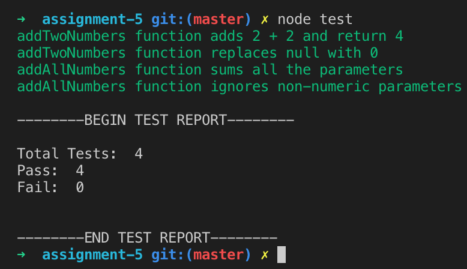

# Pirple Home Assignment #5 - Gaining Stability!
This is a simple application to emulate a test runner for two functions located in the `app/lib` folder.

### Running the tests
Type `node test` to run the tests.

  

